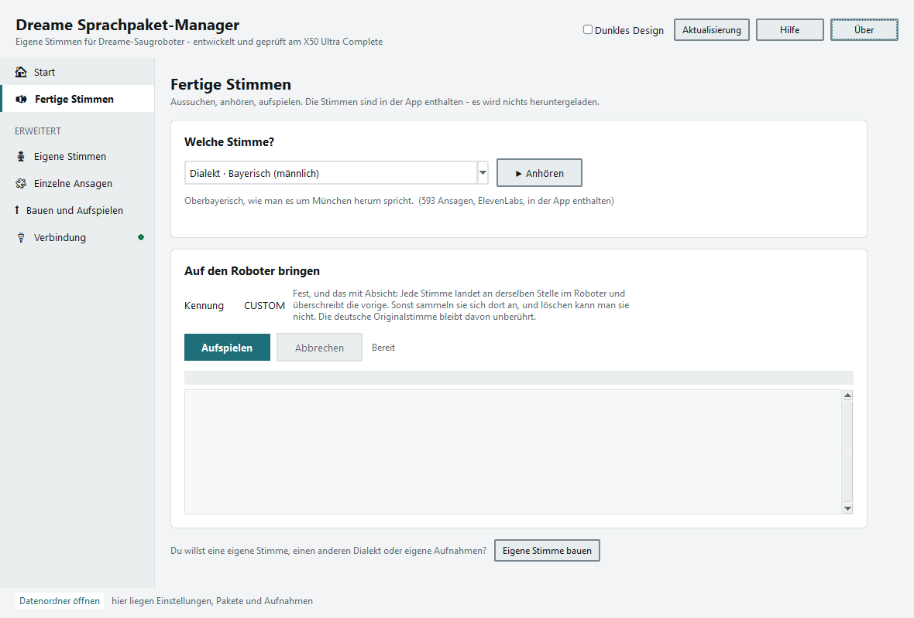

# Dreame Sprachpaket-Manager

Gib deinem Saugroboter eine andere Stimme: Bayerisch, Hessisch, Wienerisch
oder Berlinerisch. Windows-App für Roboter von **Dreame, MOVA und Trouver**.
Ohne Rooting, ohne Installation, eine einzige Datei.

```
    "So, packma's. I fang zum Saugn o."                  Bayerisch
    "Ei gude, dann geht's los. Isch fang aa zu sauge."   Hessisch
    "Na servas, dann fang ma au. I saug jetzt."          Wienerisch
    "Na denn los. Ick fang an zu sauje."                 Berlinerisch
```

**Download: [DreameSprachpaket.exe](../../releases/latest)** — rund 97 MB

1. Doppelklick. Windows meldet „Computer geschützt", weil die Datei nicht
   signiert ist: *Weitere Informationen → Trotzdem ausführen*.
2. Unter **Start** die passende App wählen (Dreamehome, MOVA Home oder
   Trouver) und mit denselben Zugangsdaten anmelden. Das Sprachpaket deines
   Roboters holt die App danach von selbst.
3. Unter **Fertige Stimmen** eine aussuchen, *Anhören*, *Aufspielen*.

Das ist der ganze Weg. Die Stimmen stecken in der Programmdatei, es wird
nichts nachgeladen. Gefällt es nicht: *Originalstimme wiederherstellen*.

**Funktioniert das mit meinem Roboter?** Wenn du in der Dreamehome-App unter
*Sprachton* eine Sprache auswählen kannst, funktioniert es. 402 Modelle
geprüft — [wie ich das geprüft habe](docs/Modelle.md).

> Privates Freizeitprojekt, MIT-Lizenz, **ohne Gewährleistung und ohne
> Haftung**. Nicht von Dreame, MOVA oder Trouver geprüft oder unterstützt.
> [Was das genau heißt](#haftungsausschluss)



---

## Was die App kann

**Fünf fertige Stimmen** sind eingebaut und sofort einsatzbereit: Bayerisch
männlich und weiblich, Hessisch, Wienerisch und Berlinerisch. Sie sprechen
echten Dialekt, auch in der Aussprache — nicht nur in der Wortwahl.

Darüber hinaus, wenn man mag: **eigene Texte** schreiben und sprechen lassen,
**eigene Aufnahmen** einlesen, **einzelne Ansagen** austauschen. Drei weitere
Dialekte — Schwäbisch, Sächsisch und Kölsch — liegen als Text bereit und
lassen sich in der App selbst vertonen. Das steht alles unter *Erweitert* und
ist nur da, wenn man es sucht. Siehe [Eigene Stimmen und
Dialekte](docs/Eigene-Stimmen.md).

**Vorher anhören:** Bevor irgendetwas auf den Roboter geht, spielt *Anhören*
vier typische Ansagen ab. Gefällt die Stimme nicht, ist nichts passiert.

**Die Lautstärke stimmt:** Jede Ansage wird auf den Pegel genau der
Originalansage gebracht, die sie ersetzt — gemessen, nicht geschätzt.

---

## Beschädigt das meinen Roboter?

Fünf Sätze, die Langfassung steht unter [Sicherheit](docs/Sicherheit.md).

* Es wird **keine Firmware** angefasst und nichts gerootet. Die App benutzt
  genau die Sprachpaket-Funktion, die der Hersteller ohnehin vorsieht — es ist
  derselbe Vorgang wie ein Sprachwechsel in der Dreamehome-App.
* Dein Paket entsteht als **Kopie des offiziellen Pakets** deines Modells.
  Ansagen, die du nicht ersetzt, bleiben unverändert.
* Der **Roboter prüft selbst** gegen Prüfsumme und Größe. Passt etwas nicht,
  verwirft er das Paket und behält seine bisherige Stimme.
* Vor dem Senden fragt die App nach, ob dein Gerät den Sprachpaket-Dienst
  überhaupt kennt. Antwortet es dort nicht, wird **gar nichts geschrieben**.
* Der **Rückweg ist ein Klick**: Die Originalstimme lädt der Roboter direkt
  bei Dreame.

Aufgespielt wird immer unter der Kennung `CUSTOM` — das ist fest und mit
Absicht. Der Roboter legt je Kennung einen eigenen Ordner an, und löschen
kann man die über die Cloud nicht. Eine einzige Kennung überschreibt sich
selbst und belegt dauerhaft nur einen Platz.

---

## Häufige Fragen

**Windows warnt vor der Datei.** Erwartet: Sie ist nicht signiert, und ein
Zertifikat kostet einige hundert Euro im Jahr. *Weitere Informationen →
Trotzdem ausführen*. Wer das nicht mag, baut sie sich in zwei Minuten selbst
([Entwicklung](docs/Entwicklung.md)).

**Mein Paket steht nicht in der Dreamehome-App.** Das ist normal und kein
Fehler — die App listet nur Dreames eigene Sprachen.
[Mehr dazu](docs/Problemloesung.md)

**Der Roboter holt das Paket nicht ab.** Meist die Windows-Firewall oder
getrennte Netze. [Was zu tun ist](docs/Problemloesung.md)

**Der Roboter klingt nach dem Wechsel leiser.** Das liegt an seiner Firmware,
nicht an den Aufnahmen — er wendet seine Lautstärke mitunter erst nach einem
Neustart wieder an. Einmal aus- und einschalten.

**Wie bekomme ich echten Dialekt in der Aussprache?** Die mitgelieferten
Stimmen haben ihn bereits. Wer eigene Texte vertont, braucht dafür ElevenLabs;
die Windows-Sprachausgabe ist kostenlos und offline, spricht den Dialekt aber
nur in der Wortwahl. [Mehr dazu](docs/Eigene-Stimmen.md)

---

## Datenschutz

* E-Mail und Passwort gehen ausschließlich an die Dreame-Server.
* **Passwort und ElevenLabs-Schlüssel liegen im
  Windows-Anmeldeinformationsspeicher** — nicht in einer Datei, nicht in der
  EXE, nie im Klartext auf der Platte. Nur falls der Anmeldespeicher nicht
  zur Verfügung steht, weicht die App auf die `config.json` aus und
  verschlüsselt dort mit der Windows-DPAPI (gebunden an dein Windows-Konto).
* Alle Dateien liegen im Ordner `Daten` neben der App. Zum Entfernen genügt
  es, diesen Ordner zu löschen.
* Die App sendet keinerlei Nutzungsdaten.

Nachgeprüft wird das bei jedem Selbsttest: Die App, ihre Zwischenstände
und die gesamte Versionsgeschichte werden nach dem Passwort und dem
ElevenLabs-Schlüssel durchsucht. Kein einziger Treffer.

### Die App weitergeben

Im Datenordner steht zwar kein Geheimnis, aber Persönliches: deine
E-Mail-Adresse, Name, Geräte-ID und MAC deines Roboters, die IP dieses PCs,
die zuletzt benutzte ElevenLabs-Stimme und das Protokoll.

Unter *Verbindung* räumt **Persönliche Daten entfernen** genau das weg —
einschließlich der Einträge im Anmeldespeicher. Deine gebauten Sprachpakete
und die Dialekttexte bleiben erhalten; darin steckt nichts Persönliches.

Wer nur die EXE weitergibt, muss ohnehin nichts tun: Die `config.json`
liegt im Datenordner.

---

---

## Lizenz

**Quellcode: MIT-Lizenz** — siehe [LICENSE](LICENSE). Du darfst die App
benutzen, verändern, weitergeben und auch in eigene Projekte übernehmen,
kommerziell wie privat. Einzige Bedingung: der Copyright-Hinweis und der
Lizenztext bleiben erhalten. Das gilt auch für die **Dialekttexte** — die sind
Teil des Quellcodes.

**Audiodateien: eigene Bedingungen** — siehe
[LICENSE-AUDIO.md](LICENSE-AUDIO.md). Die Aufnahmen in den Releases wurden mit
ElevenLabs erzeugt; eine so weitgehende Lizenz wie MIT lässt sich dafür nicht
erteilen. Privat nutzen und unverändert weitergeben: ja. Als Trainingsmaterial
für Sprachmodelle oder als eigenständiges Produkt verkaufen: nein.

---

---

## Haftungsausschluss

**Das hier ist ein privates Freizeitprojekt. Es gibt keine Garantie, keine
Zusicherung und keine Haftung — für gar nichts.**

* Die Software wird „wie besehen" bereitgestellt (`AS IS`), ohne Gewähr für
  Funktion, Eignung oder Fehlerfreiheit. Das ist keine Floskel, sondern der
  ausdrückliche Inhalt der MIT-Lizenz, unter der du sie bekommst.
* **Die Nutzung erfolgt auf eigene Verantwortung und auf eigenes Risiko.**
  Für Schäden an Roboter, Basisstation, Daten oder sonstigem Eigentum wird
  keine Haftung übernommen — soweit gesetzlich zulässig.
* Dieses Projekt steht in **keiner Verbindung zu Dreame, MOVA, Trouver oder
  Xiaomi**. Es ist von diesen Herstellern weder unterstützt noch geprüft noch
  genehmigt. Alle Marken- und Produktnamen gehören ihren jeweiligen Inhabern.
* Ein eigenes Sprachpaket ist **kein bestimmungsgemäßer Gebrauch** im Sinne
  des Herstellers. Ob dadurch Gewährleistungs- oder Garantieansprüche berührt
  werden, entscheidet allein der Hersteller. Kläre das im Zweifel vorher.
* Die App nutzt ausschließlich die vom Hersteller vorgesehene
  Sprachpaket-Funktion, fasst keine Firmware an und lässt sich jederzeit
  rückgängig machen (*Originalstimme wiederherstellen*). Das senkt das Risiko
  erheblich — eine Garantie ist es trotzdem nicht.

Wer damit nicht einverstanden ist, benutzt die App bitte nicht.

---

---

## Ein Trinkgeld?

In dieser App stecken viele Stunden Feierabend und Wochenende: das Protokoll
der Dreame-Cloud auseinandernehmen, herausfinden warum ausgetauschte Ansagen
stumm bleiben (es war die Nummern-Umsetzung), nachmessen warum eigene
Aufnahmen leiser klingen als die Originalen, und 593 Ansagen in sieben
Dialekten schreiben. Nichts davon musste sein — es hat einfach Spaß gemacht.

**Die App ist und bleibt kostenlos.** Sie liegt hier mit allem Quellcode, du
darfst sie benutzen, verändern und weitergeben.

Wenn sie dir etwas wert ist und du dich über deinen Roboter im Dialekt
gefreut hast, freue ich mich über ein Trinkgeld:

### ☕ [paypal.me/anon365project](https://paypal.me/anon365project)

Derselbe Link steht in der App unter *Über*.

Und damit das klar ist: Ein Trinkgeld ist eine **Schenkung**, keine Bezahlung
für ein Produkt. Es gibt dafür keine Gegenleistung, keinen Support-Anspruch
und keine bevorzugte Behandlung. Wer nichts gibt, bekommt genau dieselbe
Software — und ist genauso willkommen. Am Haftungsausschluss unten ändert ein
Trinkgeld nichts.

Genauso hilfreich und völlig kostenlos: einen Fehler melden, eine Verbesserung
für die Dialekttexte schicken, oder die App jemandem zeigen, der einen Dreame
hat.

---

---

## Weiterlesen

Dieselben Seiten stehen auch in der App unter **Hilfe** → *Ausführlich
nachlesen*.

| | |
|---|---|
| [Welche Roboter funktionieren](docs/Modelle.md) | geprüfte Modelle, Zuordnung der Ansagen |
| [Sicherheit](docs/Sicherheit.md) | warum das den Roboter nicht beschädigt |
| [Eigene Stimmen und Dialekte](docs/Eigene-Stimmen.md) | eigene Texte, Aufnahmen, ElevenLabs |
| [Wenn etwas nicht klappt](docs/Problemloesung.md) | Dreamehome-App, Netzwerk, Firewall |
| [Technische Hintergründe](docs/Technik.md) | Cloud statt Token, Audioformat, Lautheit |
| [Entwicklung](docs/Entwicklung.md) | Aufbau des Quellcodes, EXE selbst bauen |
| [Änderungen](CHANGELOG.md) | was sich je Fassung geändert hat |
| [Veröffentlichen](VEROEFFENTLICHEN.md) | Schritte für ein neues Release |

---
